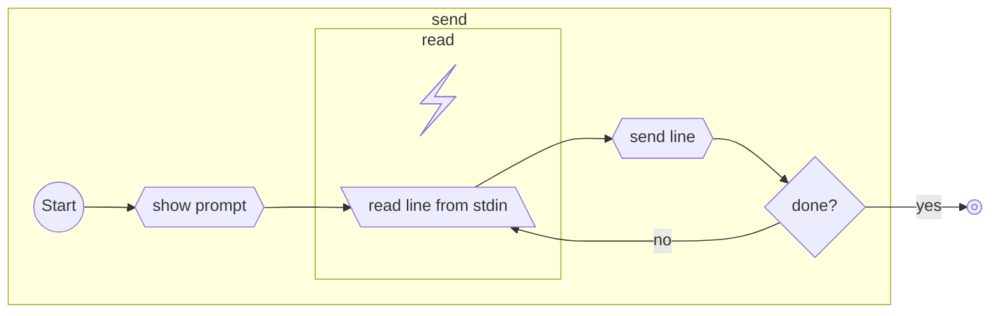
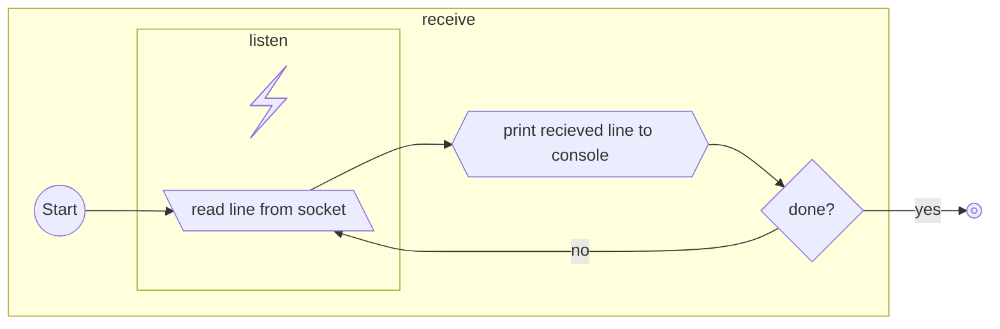
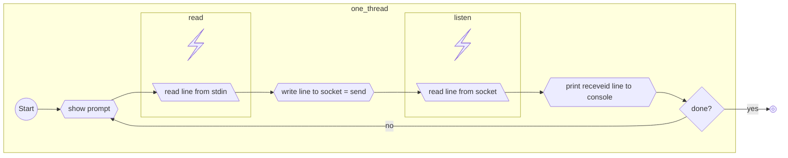
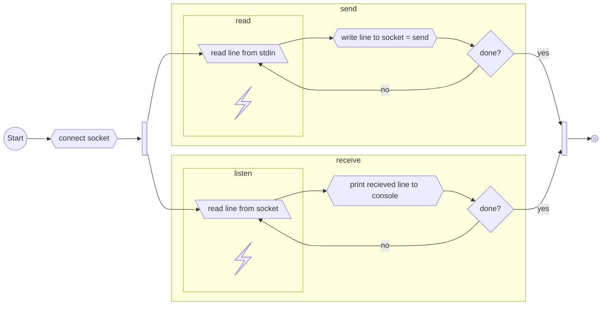
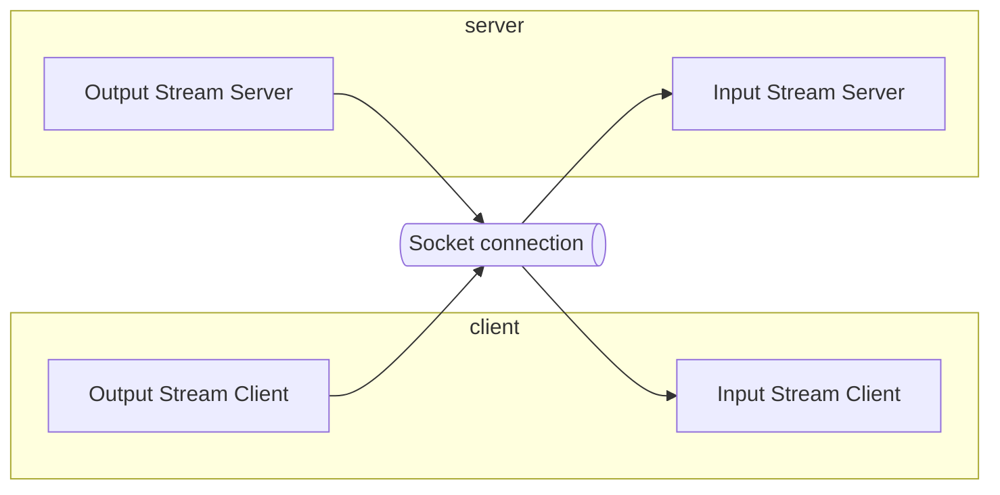

## 1. Sending lines to server from client console input

```mermaid
flowchart LR


subgraph send
prompt{{show prompt}}
subgraph read
bolt@{ shape: bolt, label: "blocking!" }
    read_console@{ shape: lean-l, label: "read line from stdin" }
    
end
send_line{{send line}}
done@{ shape: decision, label: "done?"}


start-->prompt
prompt-->read_console
read_console-->send_line
send_line-->done
end

start@{ shape: circle, label: "Start" }

stop@{ shape: framed-circle, label: "Stop" }
done--yes -->stop
done-- no -->read_console

```

## 2. Receiving Lines

```mermaid

flowchart LR
subgraph receive

    subgraph listen
        r_bolt@{ shape: bolt, label: "blocking!" }
        listen_socket@{ shape: lean-l, label: "read line from socket" }  
    end
    print_console{{print recieved line to console}}
    
    r_start-->listen_socket
    r_done@{ shape: decision, label: "done?"}

    listen_socket-->print_console
    print_console-->r_done
end

r_start@{ shape: circle, label: "Start" }

r_stop@{ shape: framed-circle, label: "Stop" }
r_done--yes -->r_stop
r_done-- no -->listen_socket
```

## 3. Send & Receive in 1 Thread

```mermaid
flowchart LR


subgraph one_thread
    prompt{{show prompt}}
    subgraph read
        bolt@{ shape: bolt, label: "blocking!" }
        read_console@{ shape: lean-l, label: "read line from stdin" }
    
    end
    send_line{{write line to socket = send}}


    subgraph listen
        r_bolt@{ shape: bolt, label: "blocking!" }
        listen_socket@{ shape: lean-l, label: "read line from socket" }  
    end
    print_console{{print receveid line to console}}
    
   


    start-->prompt
    prompt-->read_console
    read_console-->send_line
    send_line-->listen_socket
    r_done@{ shape: decision, label: "done?"}
end

start@{ shape: circle, label: "Start" }


    listen_socket-->print_console
    print_console-->r_done


r_stop@{ shape: framed-circle, label: "Stop" }
r_done--yes -->r_stop
r_done-- no -->prompt

```

## 4. Send & Receive in 2 Threads

```mermaid
flowchart LR
start@{ shape: circle, label: "Start" }
fork@{ shape: fork, label: "Fork" }
start-->socket
socket-->fork
fork-->read_console
socket{{connect socket}}
subgraph send
    subgraph read
        bolt@{ shape: bolt, label: "blocking!" }
        read_console@{ shape: lean-l, label: "read line from stdin" }
    
    end
    send_line{{write line to socket = send}}
    done@{ shape: decision, label: "done?"}


    read_console-->send_line
    send_line-->done
end


stop@{ shape: framed-circle, label: "Stop" }
done--yes -->join
join-->stop
done-- no -->read_console


fork-->listen_socket
subgraph receive
    subgraph listen
        r_bolt@{ shape: bolt, label: "blocking!" }
        listen_socket@{ shape: lean-l, label: "read line from socket" }  
    end
    print_console{{print recieved line to console}}
    
    
    r_done@{ shape: decision, label: "done?"}

    listen_socket-->print_console
    print_console-->r_done
end

r_done--yes -->join
r_done-- no -->listen_socket

join@{ shape: fork, label: "Join" }


```

## Socket Streams

```mermaid
flowchart LR
 
    S@{ shape: das, label: "Socket connection" }
    
    subgraph client
    ISC@{label: "Input Stream Client"}
    OSC@{label: "Output Stream Client"}
    end

   
  
     subgraph server
     ISS@{label: "Input Stream Server"}
        OSS@{label: "Output Stream Server"}
    end
    S-->ISS
    OSS-->S
    S-->ISC
    OSC-->S
```
