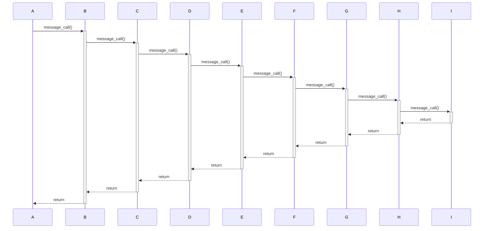
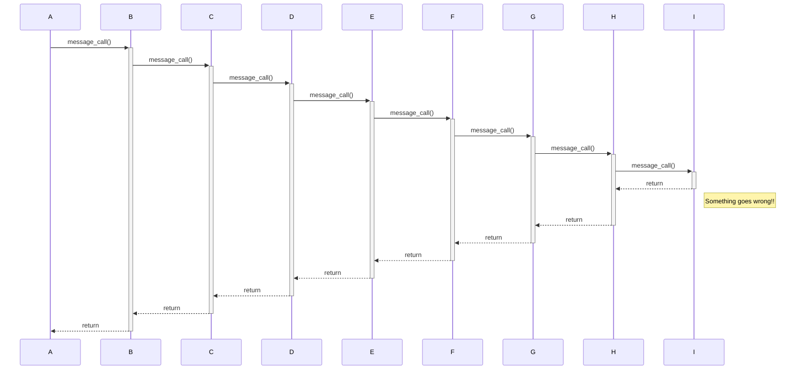
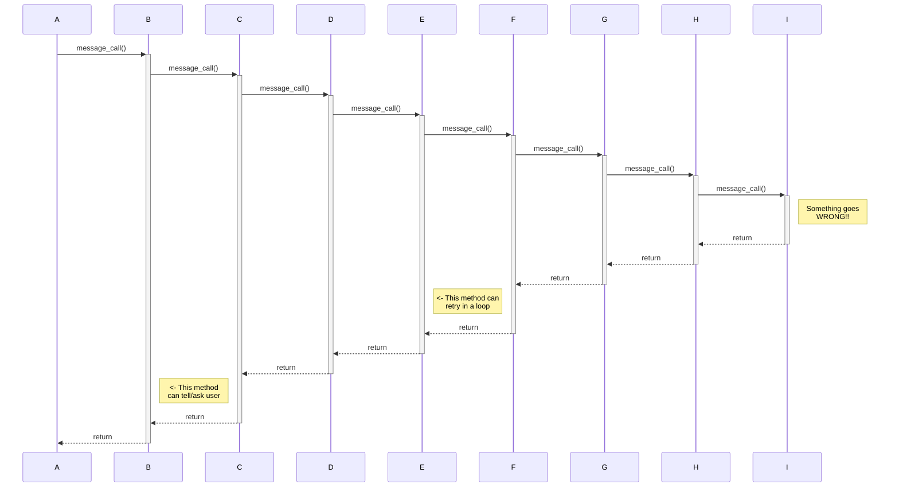
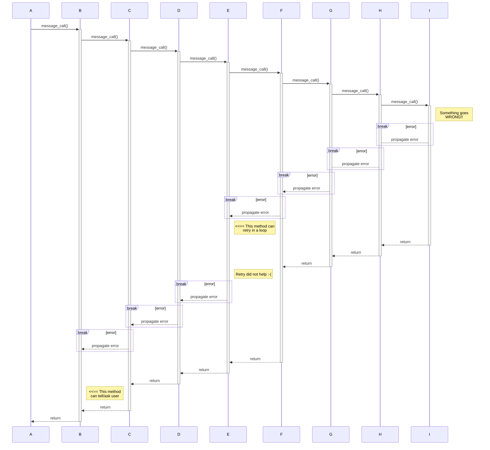
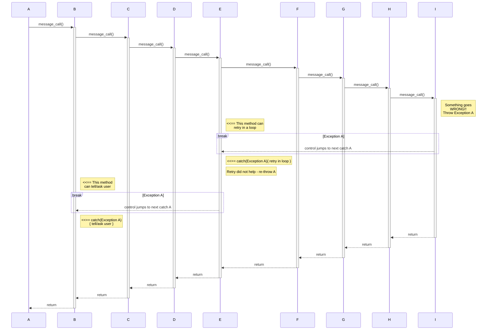

## Sequence of methods calling methods calling other methods....



## Something goes wrong
**very** deep down the call sequence...



## Where it could be fixed/handled


But.... how to tell the methods / propagate the error??

## Manual Error Propagation?

Requires adding error handling / Propagation logic to **all** methods
in between where the error occurred until it can be handled:


## With Exceptions

- if Exception A is thrown, control jumps to next enclosing catch A block up the call stack
- all methods inbetween have to either
    - do nothing if the Exception is **Unchecked**
    - declare `throws A` in their method header if the Exception is **Checked**
- see 
    - https://docs.oracle.com/javase/specs/jls/se24/html/jls-8.html#jls-MethodHeader
    - "Here's the bottom line guideline: If a client can reasonably be expected to recover from an exception, make it a checked exception. If a client cannot do anything to recover from the exception, make it an unchecked exception." https://docs.oracle.com/javase/tutorial/essential/exceptions/runtime.html
    - for example: almost every method can cause a NullPointerException - having to declare it in every method header would give no valuable information, just clutter up the code.
    - you can catch Unchecked Exceptions in principle.
    - any exception not 





   
```


