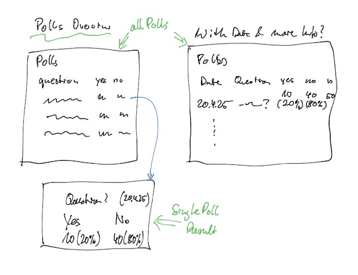

Repo for this lab: 

This lab is about designing the first two pages for your app and
populating them with data using the template engine handlebars.

## Assignment
Consult the example below and the linked docs to solve the exercises.

Use your dockerized app from last week as base for this week's express assignments. If you had trouble installing docker last week, give an update in this week's report. 

Note that **you do not need docker running** to solve this assignment. You can just start the express server with
```bash
npm run start
```


### 1. Stories and Interface Design

1. Choose about one or two stories of your project backlog. They should contain some functionality that shows your main resource.

2. Draw a rough interface sketch together. One page per person is sufficient. If you would need more pages to implement your stories, reduce or split your stories. You can always add more later.
3. Each one of you should take care of one of the pages, that is, create and commit the static page and the handlebar template. Note who did which page in your report.

### 2. Static HTML Pages

Create static (plain) HTML pages and make them available using express static. (see [Serving static files in Express](https://expressjs.com/en/starter/static-files.html) and the example app). 

### 3. Try out Handlebars

- Handlebars template engine: https://handlebarsjs.com/

Find something where you repeatedly need the same data in different formats. You can use any template engine to solve that! The repo contains
an example where I generate various Project Lists for the Showtime using handlebars - see . 
You can use  as a starting point. See [https://handlebarsjs.com/guide](https://handlebarsjs.com/guide) for the documentation.


### 4. Integrate Handlebars into your Express App and fill the Pages with example data

- Handlebars template engine: https://handlebarsjs.com/
- Handlebars integration for express: https://github.com/express-handlebars/express-handlebars

Now, create a route in express for each of your pages, create a handlebar template for each one of them. See the handlebar-express example apps as example (see the readme: ) or my example app to learn how to integrate handlebars in express.

To create the template, use the static html page as a starting point. Again, each of you should work on one of the pages/templates.

## Example App: "My Poll"
As an example, here's a simple My Poll App. It should provide polls that can easily be created, started and evaluated in group settings.
### 1. "My Poll": Stories and a Rough Interface Design
#### "My Poll" User Stories:

- As a Facilitator, I can create a new poll by entering a question that can be answered with yes or no.
- As a Facilitator, I can start a poll. 
- As a Participant, I can open the poll on my device (phone, laptop) and answer the question
- As a Facilitator, I can see the poll results after closing the poll.

Note that I've kept these stories very simple. For instance, only polls with yes/no answers are possible. Also, there is no (need of) automatic updating of the result page as the results should only be shown after the poll is closed. There is no protection against submitting multiple answers and thus skewing the results. These things can always be added in a later iteration.

#### Rough Interface Sketch:

I started drafting out the poll creation - see sketch 1.


This made me realize that this would result in 5 pages (and routes). Thus I revised my plan and reduced it to this two stories:

- As a Facilitator, I can see the results of a poll.
- As a Facilitator, I can see a list of my past polls, which links to the individual poll results.

I've added the second story to include an example for an iteration in the template (showing a collection of something)




### 2. "My Poll": Static HTML Pages
- see readme in 

### 3. Try out Handlebars
- examine the  for a real-life use case: generate various project lists for the showtime organisation.
- find an example of your own or make something up - it maybe simple. you can use the scaffold as a starting point: 
 

### 4. "My Poll": Integrate Handlebars into your Express App and fill the Pages with example data

See the source code in  for an example on how to transfer the html pages to handlebar templates.

The changes are between the tags handlebars_start and handlebars_done: [https://github.com/htw-imi-wt1/lab-03-express-first-pages/compare/handlebars_start...handlebars_done](https://github.com/htw-imi-wt1/lab-03-express-first-pages/compare/handlebars_start...handlebars_done).

Further documentation: 
- https://handlebarsjs.com/guide/

#### Lab Report

Your lab report should contain:

    - Your group number and project name
    - The names of all team members
    - the url of your repo (for the report to be complete for further     reference)
    - your updated/consolidated project proposal with a the current list of     user stories
    - The stories you've implemented in this sprint 
    - the interface sketches
    - the mapping of team member to pages
    - at least the static page as well as the handlebar template for this page    has to be commited by the respective team member.
    - A reflection on any technical issues that you have encountered and how     you resolved them (or not)
    
    - submit it as .pdf to Moodle with the filename in the form of   _group\_\<number\>\_\<project-topic\>\_lab_03.pdf_ e.g.     _group\_42_repolist\_lab_03.pdf_ 
    - every group member must upload the same report file.
