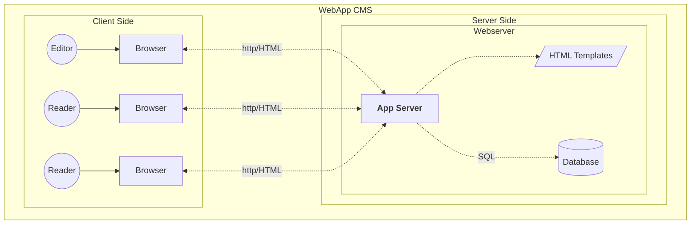

```mermaid
flowchart LR
subgraph thecms["WebApp CMS"]
direction LR


subgraph Client["Client Side"]
ed1((Editor))
re1((Reader))
re2((Reader))
  browser1
  browser2
  browser3
end


ed1 --> browser1["Browser"]
re1 --> browser2["Browser"]
re2 --> browser3["Browser"]

subgraph Server["Server Side"]
direction TB
  subgraph webserver["Webserver"]
    httpd["`
    **App Server**
    `"]
   
   templates[/HTML Templates/]
 
    httpd -..->templates
   httpd -..->|SQL|db
     db[("Database")]
   
  end

end

browser1 <-..->|http/HTML| httpd

browser2 <-..->|http/HTML| httpd

browser3 <-..->|http/HTML| httpd
end
```
